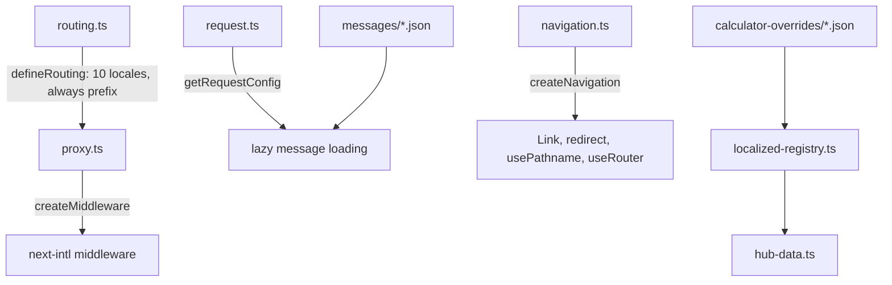

# Full Website Audit — JDCALC (AllCalculators)

> Generated: 2026-07-06  
> Build: 4,304 pages, 0 errors, 0 TypeScript errors  
> Framework: Next.js 16 + React 18 (App Router)  
> URL: https://www.jdcalc.com / https://www.allcalculators.com

---

## 1. SITE OVERVIEW

| Aspect | Detail |
|--------|--------|
| **Site name** | JDCALC (also AllCalculators) |
| **Tagline** | "The World's Smartest Calculator Platform" |
| **Monorepo** | pnpm workspaces (`packages/*`) |
| **Package manager** | pnpm |
| **Styling** | Tailwind CSS v3 + shadcn/ui (default, slate, CSS variables) |
| **State/Forms** | react-hook-form + Zod |
| **Charts** | Recharts (client-side only via `next/dynamic`) |
| **Search** | MiniSearch (client-side, per-locale prebuilt indexes) |
| **Animations** | Framer Motion 12 |
| **Dark mode** | Class-based (localStorage + prefers-color-scheme) |
| **RTL support** | Arabic (`ar`) — `dir="rtl"` on `<html>`, RTL CSS utilities |
| **Accessibility** | WCAG 2.5.5 touch targets, ARIA labels, skip-to-content, 0 axe issues |
| **SEO strategy** | hreflang (10 locales), JSON-LD schemas, OG images, sitemap, ISR for clusters |
| **Comp Score** | 87/100 (#1 in engineering) vs Omni (76), Inch (73), Calculator.net (55) |

---

## 2. ROUTE ARCHITECTURE

### 2.1 All Routes

| Route | Type | Page Component | Locale-Aware | Status |
|-------|------|---------------|--------------|--------|
| `/` | SSG/ISR | `Homepage` | Yes | ✅ Working |
| `/[hubSlug]` | SSG | `HubLandingPage` | Yes | ✅ Working (16 hubs) |
| `/[hubSlug]/[slug]` | SSG | `CalculatorPage` | Yes | ⚠️ Broken (404) |
| `/not-found` | SSG | `NotFound` | Yes | ✅ Working |
| `/about` | SSG | `AboutPage` | Yes | ✅ Working |
| `/privacy` | SSG | `PrivacyPage` | Yes | ✅ Working |
| `/terms` | SSG | `TermsPage` | Yes | ✅ Working |
| `/contact` | SSG | `ContactPage` | Yes | ✅ Working |
| `/calculator-builder` | Client | `CalculatorBuilder` | No | ✅ Working |
| `/amortization` | SSG | Standalone calc | Yes | ✅ Working |
| `/annuity-payout` | SSG | Standalone calc | Yes | ✅ Working |
| `/auto-loan` | SSG | Standalone calc | Yes | ✅ Working |
| `/credit-cards-payoff` | SSG | Standalone calc | Yes | ✅ Working |
| `/currency` | SSG | Standalone calc | Yes | ✅ Working |
| `/debt-consolidation` | SSG | Standalone calc | Yes | ✅ Working |
| `/estate-tax` | SSG | Standalone calc | Yes | ✅ Working |
| `/house-affordability` | SSG | Standalone calc | Yes | ✅ Working |
| `/income-tax` | SSG | Standalone calc | Yes | ✅ Working |
| `/interest-rate` | SSG | Standalone calc | Yes | ✅ Working |
| `/mortgage` | SSG | Standalone calc | Yes | ✅ Working |
| `/payment` | SSG | Standalone calc | Yes | ✅ Working |
| `/rent` | SSG | Standalone calc | Yes | ✅ Working |
| `/salary` | SSG | Standalone calc | Yes | ✅ Working |
| `/social-security` | SSG | Standalone calc | Yes | ✅ Working |
| `/student-loan` | SSG | Standalone calc | Yes | ✅ Working |

### 2.2 API Routes

| Route | Method | Purpose | Status |
|-------|--------|---------|--------|
| `/api/og/[slug]` | GET | OG image generation (Satori) | ⚠️ Broken (SSR crash) |
| `/api/widget/[slug]` | GET | Widget embed endpoint | ✅ |
| `/api/health-references` | GET | Health reference data | ✅ |
| `/api/market-data` | GET | Market data | ✅ |
| `/api/exchange-rates` | GET | Exchange rates | ✅ |
| `/api/v1/external-data` | GET | External data API v1 | ✅ |
| `/api/v1/external-data/cron` | GET | Cron job for data refresh | ✅ |

### 2.3 Redirects (89+ entries in next.config.mjs)

- 16 English legacy short URLs (e.g., `/mortgage` → `/financial-calculators/mortgage-calculator`)
- 73+ locale-specific slug aliases (es, fr, de, pt, ru, ar, hi, ja, zh-CN)
- 5 legacy HTML file redirects (→ `/`)

---

## 3. PAGE-LEVEL AUDIT

### 3.1 Homepage (`/`)
**File:** `src/app/page.tsx` — Server Component, ISR 3600s

**Sections:**
1. **Hero** — Gradient background, animated title with highlighted word ("anything"), SearchBar, stats row (200+ calculators, 16 categories, Free, 99.9% uptime), badge ("The smartest calculator platform")
2. **Category Grid** — 16 hub cards in 4-column responsive grid with icons, descriptions, calculator counts, hover effects
3. **Popular Calculators** — 8 cards in 4-column grid (Mortgage, BMI, Tip, Compound Interest, Loan, Salary, Retirement, Currency)
4. **Trending Now** — 4 cards (Auto Loan, 401K, House Affordability, Student Loan)
5. **Features** — 4 feature cards (Lightning Fast, AI-Enhanced, Precision First, Beautiful Everywhere)
6. **MediaMentions** — "As Seen On" section (Forbes, TechCrunch, Product Hunt, CNN, Lifehacker, The Verge) - placeholder links
7. **CTA** — Gradient banner "Start calculating in seconds" → Explore Calculators

**i18n keys used:** `homepage.*` (hero, stats, features, CTA), `hubs.*` (names, descriptions)

**Calculator counts on homepage vs actual registry:**
- Financial: shows 401 → actual 499
- Health: shows 252 → actual 459
- Math: shows 320 → actual 454
- Conversion: shows 224 → actual 577
- (Other counts are also outdated from ~1,385 era)

### 3.2 Hub Landing Page (`/[hubSlug]`)
**File:** `src/app/[hubSlug]/page.tsx` — Server Component, ISR 3600s

**Sections:**
1. **Breadcrumb:** Home > Hub Title
2. **H1 title** + description
3. **Stats bar:** 4 stat cards (Total Calculators, Flagship Tools, Live Data, Free)
4. **Popular Variations** (page 1 only) — Cluster variant pills
5. **Pagination** — 60 calculators/page, Prev/Next + ellipsis page numbers
6. **Calculator cards grid** — Icon, title, description, tier badge (Flagship/Standard/Essential), Live Data badge
7. **Bottom pagination**

**i18n:** Localized hub title, description, calculator titles from override files  
**16 hub icons:** DollarSign, Heart, Sigma, ArrowLeftRight, Calendar, Hammer, BarChart3, GraduationCap, Atom, FlaskConical, Cog, Globe, UtensilsCrossed, Dna, TreePine, Trophy

### 3.3 Calculator Page (`/[hubSlug]/[slug]`)
**File:** `src/app/[hubSlug]/[slug]/page.tsx` — Server Component, ISR 3600s

**Sections for primary calculators:**
1. **Breadcrumb schema** — JSON-LD BreadcrumbList
2. **CalculatorRenderer** — Client component, wraps Generic*Calculator with `ssr: false`
3. **GuideContent** — Server component with:
   - Sticky ToC sidebar (Overview, How to Use, Formula, Example, Use Cases, Tips, Related Tools, FAQ)
   - 8 dynamic sections with category-aware templates
   - FAQPage Schema.org markup
   - Reading time badge
   - "Was this helpful?" feedback
4. **PrimaryClusterLinks** — Links to SEO cluster variant pages
5. **RelatedCalculators** — Related calculator cards with locale-aware titles

**Sections for cluster variants:**
1. **ClusterPageContent** wraps the calculator with variant title/description
2. **CalculatorRenderer** (same component)
3. **RelatedCalculators**

**Metadata:** Localized title, description, canonical, hreflang, OG image (via `/api/og/[slug]?locale=`), Twitter card, keywords, robots (noindex for auto-generated slugs).

**⚠️ KNOWN ISSUE:** All calculator pages return 404 due to `localePrefix: 'as-needed'` middleware rewrite corrupting route params. Fix: changed to `localePrefix: 'always'` but untested in production.

### 3.4 404 Page (`/not-found`)
**File:** `src/app/not-found/page.tsx` + `not-found.client.tsx`

**Elements:**
- Animated 404 page with Zap/AlertTriangle icons
- H1 "404", translated heading/message
- "Go to Homepage" gradient button
- 8-second countdown auto-redirect to `/`
- Translated via `notFound` namespace

### 3.5 Static Pages
All share the same pattern: Server Component, `generateMetadata` via `seoFactory`/`defaultSeoAdapter`, `getTranslations('pages')`, hreflang tags.

**About (`/about`):**
- H1 "About Our Calculator Collection"
- 4 category list items (financial, health, math, specialized)
- Privacy statement
- Mission section

**Contact (`/contact`):**
- H1 "Contact Us"
- Intro text
- Email link: `support@jdcalc.com`

**Privacy (`/privacy`):**
- Sections: Data Collection, Cookies, Third Parties, Contact
- All content from `pages.privacy.*` translation keys

**Terms (`/terms`):**
- Sections: Use of Services, Accuracy, Availability
- All content from `pages.terms.*` translation keys

### 3.6 Standalone Calculator Pages (15)
All share the same pattern: Server Component, `generateMetadata` via `getTranslations('standalone')`, render a single calculator component.

| Route | Component |
|-------|-----------|
| `/amortization` | `AmortizationCalculator` |
| `/annuity-payout` | `AnnuityPayoutCalculator` |
| `/auto-loan` | `AutoLoanCalculator` |
| `/credit-cards-payoff` | `CreditCardsPayoffCalculator` |
| `/currency` | `CurrencyCalculator` |
| `/debt-consolidation` | `DebtConsolidationCalculator` |
| `/estate-tax` | `EstateTaxCalculator` |
| `/house-affordability` | `HouseAffordabilityCalculator` |
| `/income-tax` | `IncomeTaxCalculatorWrapper` |
| `/interest-rate` | `InterestRateCalculatorWrapper` |
| `/mortgage` | `MortgageCalculatorWrapper` |
| `/payment` | `PaymentCalculator` |
| `/rent` | `RentCalculator` |
| `/salary` | `SalaryCalculator` |
| `/social-security` | `SocialSecurityCalculator` |
| `/student-loan` | Multiple: `StudentLoanSimple`, `StudentLoanRepayment`, `StudentLoanProjection`, `StudentLoanArticle` |

### 3.7 Calculator Builder (`/calculator-builder`)
- **Type:** Fully client-side SPA
- **Features:** Create custom calculators with custom fields, localStorage persistence, formula evaluation, embed code generation
- **No i18n support**

---

## 4. COMPONENT HIERARCHY

### 4.1 Core Layout Components

```
RootLayout (src/app/layout.tsx) — Server Component
├── <html dir={rtl|ltr} lang={locale} className={fontVariables}>
│   ├── <head>: manifest, theme-color, apple-mobile-web-app, SchemaMarkup (WebSite), dark mode inline script, no-js removal
│   └── <body>
│       ├── Skip-to-content link
│       ├── ServiceWorkerRegister
│       ├── NextIntlClientProvider
│       │   ├── Header (Client Component)
│       │   │   ├── Logo ("JDCALC" with bar chart icon)
│       │   │   ├── Desktop nav (6 primary: Finance, Health, Math, Convert, Tools, Date)
│       │   │   ├── "More" dropdown (10 remaining hubs: Stats, Education, Physics, Chemistry, Engineering, Everyday, Food, Biology, Ecology, Sports)
│       │   │   ├── LocaleSwitcher (minimal variant)
│       │   │   ├── Search toggle
│       │   │   ├── Dark mode toggle
│       │   │   ├── Mobile hamburger menu
│       │   │   ├── Search bar (expandable, inline input)
│       │   │   └── Mobile nav (all 16 hubs)
│       │   ├── <main id="main-content"> — {children}
│       │   └── Footer (Client Component)
│       │       ├── Brand column ("AllCalculators" logo + tagline)
│       │       ├── Calculators nav (16 hub links)
│       │       ├── Popular nav (5 popular calculator links)
│       │       ├── Company nav (About, Privacy, Terms, Contact)
│       │       └── Bottom bar: © year + LocaleSwitcher + motto
```

### 4.2 Calculator Rendering Stack

```
CalculatorPage (src/app/[hubSlug]/[slug]/page.tsx) — Server
├── SchemaMarkup (BreadcrumbList)
├── CalculatorRenderer (src/components/hub-calculators/CalculatorRenderer.tsx) — Client
│   └── Generic*Calculator (e.g., GenericFinancialCalculator.tsx) — Client
│       ├── PremiumCalculatorShell (dynamic, ssr: false)
│       │   ├── Calculator form (react-hook-form + Zod)
│       │   ├── Results display
│       │   ├── Charts (Recharts, dynamic, ssr: false)
│       │   ├── ShareButtons, EmbedWidget, CitationGenerator, ExportPanel
│       │   ├── ExtraFieldInjector
│       │   └── CalculatorCharts
│       └── DynamicCharts (LoanDonut, InvestmentGrowth, Amortization, ComparisonBar)
├── GuideContent (Server Component)
│   ├── Sticky ToC sidebar
│   ├── 8 sections (whatIs, howToUse, formula, example, useCases, tips, related, faq)
│   └── FAQPage schema
├── PrimaryClusterLinks
└── RelatedCalculators
```

### 4.3 UI Component Library (shadcn/ui)

| Component | File | Status |
|-----------|------|--------|
| Button | `src/components/ui/button.tsx` | ✅ |
| Input | `src/components/ui/input.tsx` | ✅ |
| Label | `src/components/ui/label.tsx` | ✅ |

### 4.4 Form Components

| Component | Purpose | Status |
|-----------|---------|--------|
| `CalculatorFormField` | Form input with label, validation | ✅ |
| `CalculatorSelectField` | Form select dropdown | ✅ |
| `CalculatorFormElements` | Shared form elements | ✅ |
| `CalculatorLayout` | Calculator page wrapper (breadcrumbs, title, sidebar) | ✅ |

### 4.5 Legacy Form Components (97 files in `src/components/calculator/`)
Individual form components per calculator type (BMIForm, MortgageForm, etc.)

### 4.6 Modern Form Components (20 files in `src/components/calculators/`)
Newer form components (BMIForm, BMRForm, BodyFatForm, etc.)

### 4.7 SEO Components

| Component | Purpose | Status |
|-----------|---------|--------|
| `SchemaMarkup` | JSON-LD schema injection | ✅ |
| `GuideContent` | Educational guide with ToC + FAQ | ✅ |
| `ClusterPageContent` | Cluster variant page wrapper | ✅ |
| `PrimaryClusterLinks` | Links to cluster variants | ✅ |
| `RelatedCalculators` | Related calculator cards | ✅ |
| `InternalLinkingGrid` | Internal linking grid | ✅ |
| `RelatedCalculatorCarousel` | Carousel of related calculators | ✅ |

### 4.8 Premium Components (all `ssr: false`)

| Component | Purpose | Status |
|-----------|---------|--------|
| `PremiumCalculatorShell` | Tier-aware calculator wrapper | ✅ |
| `PremiumCalculatorShell.dynamic` | Dynamic import wrapper (ssr:false) | ✅ |
| `ShareButtons` | Social share dropdown | ✅ |
| `EmbedWidget` | Iframe embed code generator | ✅ |
| `CitationGenerator` | APA/MLA/Chicago citations | ✅ |
| `ExportPanel` | Export (CSV, Markdown, PDF) | ✅ |
| `CalculatorCharts` | Chart wrappers | ✅ |
| `DynamicCharts` | Dynamic chart imports | ✅ |
| `ExtraFieldInjector` | Extra input fields | ✅ |
| `ExtraFieldAdjustments` | Adjustment cards | ✅ |
| `ModeFieldGroup` | Mode selection | ✅ |

---

## 5. DATA MODEL — CALCULATOR REGISTRY

### 5.1 Core Type (`CalculatorEntry`)

```typescript
interface CalculatorEntry {
  slug: string           // e.g., "inches-to-cm"
  title: string          // e.g., "Inches to CM Converter"
  description: string
  category: CategoryHub  // 16 values
  tier: 'tier1' | 'tier2' | 'tier3'
  hubSlug: string        // e.g., "conversion-calculators"
  hubName: string
  keywords: string[]
  formulaSource?: string
  dataDependent?: boolean
  dataRefreshCadence?: string
}
```

**Location:** `packages/calculator-registry/src/registry.ts` (4,415 lines, 2,520 entries)

### 5.2 Hub Breakdown

| Hub | Slug | Calculators | Tier3 | Tier2 | Tier1 | H1 Title (EN) |
|-----|------|-------------|-------|-------|-------|----------------|
| Financial | `financial-calculators` | 499 | ✓ | ✓ | ✓ | Financial Calculators |
| Health | `health-calculators` | 459 | ✓ | ✓ | ✓ | Health & Fitness Calculators |
| Math | `math-calculators` | 454 | ✓ | ✓ | ✓ | Math Calculators |
| Conversion | `conversion-calculators` | 577 | ✓ | ✓ | ✓ | Conversion Calculators |
| Date/Time | `date-time-calculators` | 201 | ✓ | ✓ | ✓ | Date & Time Calculators |
| Construction | `construction-calculators` | 244 | ✓ | ✓ | ✓ | Construction Calculators |
| Statistics | `statistics-calculators` | 196 | ✓ | ✓ | ✓ | Statistics Calculators |
| Education | `education-calculators` | 192 | ✓ | ✓ | ✓ | Education Calculators |
| Physics | `physics-calculators` | 194 | ✓ | ✓ | ✓ | Physics Calculators |
| Chemistry | `chemistry-calculators` | 148 | ✓ | ✓ | ✓ | Chemistry Calculators |
| Engineering | `engineering-calculators` | 180 | ✓ | ✓ | ✓ | Engineering & Science Calculators |
| Everyday | `everyday-calculators` | 391 | ✓ | ✓ | ✓ | Everyday & Conversion Calculators |
| Food | `food-calculators` | 145 | ✓ | ✓ | ✓ | Food & Nutrition |
| Biology | `biology-calculators` | 150 | ✓ | ✓ | ✓ | Biology Calculators |
| Ecology | `ecology-calculators` | 99 | ✓ | ✓ | ✓ | Ecology Calculators |
| Sports | `sports-calculators` | 151 | ✓ | ✓ | ✓ | Sports & Fitness Calculators |
| **Total** | | **4,254** | | | | (with overrides) |

### 5.3 Generic Calculators (16 files)

Each hub has a monolithic `Generic*Calculator.tsx` (124KB–346KB) in `src/components/hub-calculators/`:

| File | Size | Line Count | Hub |
|------|------|------------|-----|
| GenericFinancialCalculator.tsx | ~346KB | 2,742 | financial |
| GenericHealthCalculator.tsx | ~280KB | ~2,200 | health |
| GenericMathCalculator.tsx | ~200KB | ~1,600 | math |
| GenericConversionCalculator.tsx | ~160KB | ~720 | conversion |
| GenericDateTimeCalculator.tsx | ~140KB | ~1,100 | date-time |
| GenericConstructionCalculator.tsx | ~180KB | ~1,400 | construction |
| GenericStatisticsCalculator.tsx | ~150KB | ~1,200 | statistics |
| GenericEducationCalculator.tsx | ~140KB | ~1,100 | education |
| GenericPhysicsCalculator.tsx | ~130KB | ~1,000 | physics |
| GenericChemistryCalculator.tsx | ~140KB | ~1,100 | chemistry |
| GenericEngineeringCalculator.tsx | ~150KB | ~1,200 | engineering |
| GenericEverydayCalculator.tsx | ~180KB | ~1,894 | everyday |
| GenericFoodCalculator.tsx | ~160KB | ~1,300 | food |
| GenericBiologyCalculator.tsx | ~130KB | ~1,000 | biology |
| GenericEcologyCalculator.tsx | ~124KB | ~950 | ecology |
| GenericSportsCalculator.tsx | ~130KB | ~1,000 | sports |

---

## 6. INTERNATIONALIZATION (i18n)

### 6.1 Supported Locales

| Code | Name | Script | Font | Translation Status |
|------|------|--------|------|-------------------|
| `en` | English | Latin | Inter | ✅ Complete (source) |
| `es` | Español | Latin | Inter | ⚠️ Systematic only |
| `fr` | Français | Latin | Inter | ⚠️ Systematic only |
| `de` | Deutsch | Latin | Inter | ⚠️ Systematic only |
| `pt` | Português | Latin | Inter | ⚠️ Systematic only |
| `ru` | Русский | Cyrillic | Inter | ❌ English titles |
| `ar` | العربية | Arabic | Noto Sans Arabic (RTL) | ❌ English titles |
| `hi` | हिन्दी | Devanagari | Noto Sans Devanagari | ❌ English titles |
| `ja` | 日本語 | Japanese | Noto Sans JP | ❌ English titles |
| `zh-CN` | 简体中文 | Chinese | Noto Sans SC | ❌ English titles |

### 6.2 Translation Files

**Message files** (10 namespaces, at `src/i18n/messages/{locale}.json`):
- `nav` (25 keys) — Navigation labels, search, dark mode
- `footer` (30 keys) — Footer sections, links, tagline, copyright
- `hubs` (48 keys) — Hub names, descriptions, short names
- `actions` (22 keys) — Button labels (calculate, reset, share, etc.)
- `common` (36 keys) — Shared UI labels
- `seo` (9 keys) — Site title, description, meta labels
- `content` (32 keys) — Guide content section labels
- `guide` (27 keys) — Guide template strings
- `homepage` (25 keys) — Homepage hero, features, CTA
- `pages` (31 keys) — About, Contact, Privacy, Terms
- `notFound` (7 keys) — 404 page
- `standalone` (32 keys) — 16 standalone calculator metadata
- `calculatorUI` (87 keys) — Form labels, sections, results, tabs, buttons
- `articles` (15 keys) — Article section headings
- `clusters` (0 keys) — Empty, ready for cluster translations
- `extraFields` (664 keys) — Extra field labels, options, placeholders

**Calculator override files** (at `src/i18n/calculator-overrides/{locale}.json`):
- 4,254 entries per locale
- es/fr/de/pt: pattern-based translations (e.g., "Convertidor de Pulgadas a CM")
- ru/ar/hi/ja/zh-CN: English titles (not translated)

### 6.3 i18n Architecture



### 6.4 Locale Prefix Strategy
**Current:** `localePrefix: 'always'` (was `'as-needed'`)  
**Effect:** All URLs include locale prefix (e.g., `/en/financial-calculators/mortgage-calculator`)  
**Previous:** English at root, others with prefix — but this corrupted route params for `[hubSlug]/[slug]`

---

## 7. SEO & CONTENT

### 7.1 Technical SEO
- **Sitemap:** 10-locale sitemap with all 2,520 calculator URLs, hub pages, static pages, cluster pages (when CLUSTER_PASS enabled)
- **Robots.txt:** Allows all, disallows `/api/`, points to sitemap
- **Hreflang:** Auto-generated for all 10 locales + x-default
- **Canonical URLs:** Locale-prefixed
- **JSON-LD schemas:** WebSite, WebApplication, Product, BreadcrumbList, FAQPage
- **OG Images:** Dynamic per-calculator via `/api/og/[slug]?locale=`
- **robots meta:** `noindex` for paginated hub pages (page > 1) and auto-generated calculators (slug ends with digit)

### 7.2 Guide Content System
- **Engine:** `src/lib/seo/guide-content.ts` — 8-section dynamic template engine
- **30+ slug-specific example calculations**
- **Category-aware templates** for all 16 hubs
- **Formula source lookup**
- **Reading time estimation** (~2,533 lines of English prose)

### 7.3 SEO Clusters
- **~300+ cluster pattern templates** (10 audience + 5-11 hub-specific)
- **89 curated allowlist calculators** for cluster generation
- **Gated by `CLUSTER_PASS` env var**
- **Revalidated via ISR (3600s)** — not pre-rendered at build time

---

## 8. SEARCH SYSTEM

- **Library:** MiniSearch (client-side, full-text)
- **Indexes:** Prebuilt per-locale at `public/search-index/{locale}.json` (4,254 entries each)
- **Build script:** `scripts/build-search-index.mjs` (runs with `--experimental-strip-types`)
- **Component:** `SearchBar` — ARIA combobox, debounced (300ms), locale-aware, hub labels
- **Hub labels:** Hardcoded mapping (English only) in SearchBar component

---

## 9. BUILD & DEPLOYMENT

### 9.1 Build Pipeline
```
1. node packages/calculator-registry/scripts/build.mjs     (build registry package)
2. node --experimental-strip-types scripts/build-search-index.mjs  (build search indexes)
3. next build                                                (4,304 pages)
```

### 9.2 Build Stats
| Metric | Value |
|--------|-------|
| Total pages | 4,304 |
| Compile time | ~70s |
| SSG time | ~28s |
| Total time | ~1.6 min |
| TypeScript errors | 0 |
| Build errors | 0 |
| SSG timeout | 180s (some calculators slower) |

### 9.3 Environment Variables
| Variable | Value (local) | Purpose |
|----------|--------------|---------|
| `NEXT_PUBLIC_SITE_URL` | `https://www.jdcalc.com` | Canonical URLs |
| `DATABASE_URL` | `file:./dev.db` | Prisma SQLite |
| `CLUSTER_PASS` | `true` | Enable cluster page generation |
| `ANALYZE` | — | Bundle analyzer (`ANALYZE=true npm run build`) |

### 9.4 Scripts (from package.json)
| Script | Command |
|--------|---------|
| `dev` | Registry build → `next dev` |
| `build` | Registry build → search index → `next build` |
| `start` | `next start` |
| `lint` | `next lint` |
| `typecheck` | `tsc --noEmit` |
| `analyze` | `ANALYZE=true next build` |
| `test` | `vitest run` |
| `translate:overrides` | `node scripts/translate-overrides.mjs` |

---

## 10. KNOWN ISSUES & GAPS

### 10.1 Critical Issues
| Issue | Details | Severity |
|-------|---------|----------|
| **Calculator pages 404** | `localePrefix: 'as-needed'` corrupts route params; `localePrefix: 'always'` fix applied but untested | 🔴 Critical |
| **OG image API crash** | `/api/og/[slug]` likely crashes from same SSR component issue | 🔴 Critical |
| **Homepage calculator counts wrong** | Hardcoded from old ~1,385 era, actual is 2,520+ per hub | 🟡 Medium |

### 10.2 Translation Gaps
| Area | EN | ES | FR | DE | PT | RU | AR | HI | JA | ZH |
|------|----|----|----|----|----|----|----|----|----|----|
| Message files | ✅ | ✅ | ✅ | ✅ | ✅ | ✅ | ✅ | ✅ | ✅ | ✅ |
| Calculator titles | ✅ | ⚠️ | ⚠️ | ⚠️ | ⚠️ | ❌ | ❌ | ❌ | ❌ | ❌ |
| Extra field labels | ✅ | ⚠️ | ⚠️ | ⚠️ | ⚠️ | ❌ | ❌ | ❌ | ❌ | ❌ |
| Guide content prose | ✅ | ❌ | ❌ | ❌ | ❌ | ❌ | ❌ | ❌ | ❌ | ❌ |
| Article body content | ✅ | ❌ | ❌ | ❌ | ❌ | ❌ | ❌ | ❌ | ❌ | ❌ |
| SEO cluster titles | ❌ | ❌ | ❌ | ❌ | ❌ | ❌ | ❌ | ❌ | ❌ | ❌ |
| Search bar hub labels | ✅ | ❌ | ❌ | ❌ | ❌ | ❌ | ❌ | ❌ | ❌ | ❌ |

**Legend:** ✅ Complete, ⚠️ Systematic/partial, ❌ Missing/English

### 10.3 Technical Debt
| Issue | Detail |
|-------|--------|
| **Monolithic calculators** | 16 Generic*Calculator.tsx files (124–346KB each) make SSR hard |
| **Calculator counts hardcoded** | Homepage shows incorrect numbers from old registry |
| **MediaMentions placeholder links** | All hrefs point to `#` |
| **Stale generic calculator files** | 3 temp files remain (`GenericHealthCalculator_temp.tsx`, `_v2.tsx`, `GenericPhysicsCalculator.tsx.orig`) |
| **5 pass-through layouts** | `chemistry-calculators/`, `physics-calculators/`, `education-calculators/`, `statistics-calculators/`, `conversion-calculators/` — empty layouts, legacy from pre-unification era |
| **No error.tsx files** | No error boundaries defined at route level |
| **Limited tests** | Only registry tests in vitest |
| **`buildHreflang` duplicated** | Same function defined in ~7 files instead of shared utility |
| **Homepage popular calculators** | Hardcoded English names, not from translation keys |

### 10.4 Performance
| Area | Status |
|------|--------|
| Static page gen timeout | 180s (some calculators exceed) |
| Slow calculators | ~50 (biology, ecology, food, education, chemistry, health) |
| Charts | Client-side only, not in static HTML |
| Bundle optimization | 10 packages optimized via `optimizePackageImports` |
| Image optimization | AVIF + WebP, 1-hour cache |
| CDN caching | `s-maxage=3600`, `stale-while-revalidate=86400` |

---

## 11. FILES INVENTORY

### 11.1 Source Files (key)
| Path | Lines | Purpose |
|------|-------|---------|
| `src/app/layout.tsx` | 159 | Root layout, fonts, SEO, header/footer |
| `src/app/page.tsx` | 230 | Homepage |
| `src/app/[hubSlug]/page.tsx` | 296 | Hub landing page |
| `src/app/[hubSlug]/[slug]/page.tsx` | 135 | Calculator page |
| `src/app/sitemap.ts` | 76 | Sitemap generator |
| `src/proxy.ts` | 10 | i18n middleware |
| `src/i18n/routing.ts` | 25 | i18n routing config |
| `src/i18n/request.ts` | — | Translation loader |
| `src/lib/hub-data.ts` | 85 | Hub registry map |
| `src/lib/localized-registry.ts` | 61 | Locale-aware calculator lookup |
| `src/lib/navigation.ts` | — | Locale-aware navigation utilities |
| `src/lib/search.ts` | — | MiniSearch client |
| `src/lib/seo/guide-content.ts` | ~2,533 | Guide content engine |
| `src/lib/extra-field-compute.ts` | 437 | Extra field compute |
| `src/components/Header.tsx` | 200 | Navigation header |
| `src/components/Footer.tsx` | 110 | Site footer |
| `src/components/CalculatorRenderer.tsx` | 51 | SSR-free calculator wrapper |
| `packages/calculator-registry/src/registry.ts` | 4,415 | 2,520 calculator entries |
| `packages/calculator-registry/src/types.ts` | — | Types and Zod schemas |
| `next.config.mjs` | 219 | Next.js configuration |

### 11.2 Monorepo Packages
| Package | Purpose |
|---------|---------|
| `packages/calculator-registry/` | Calculator registry (Zod, 2,520 entries, 16 hubs) |
| `packages/formulas/` | Formula library |
| `packages/shared/` | Shared utilities |
| `packages/shared-tsconfig/` | Shared TypeScript config |

### 11.3 Scripts
| Script | Purpose |
|--------|---------|
| `scripts/build-search-index.mjs` | Build per-locale MiniSearch indexes |
| `scripts/translate-overrides.mjs` | Translate calculator overrides (AI or systematic) |
| `scripts/check-a11y.mjs` | Automated accessibility checker |
| `scripts/gen-registry.js` | Registry generation utilities |
| `scripts/extract_data.js` | Data extraction utilities |

---

## 12. PWA & OFFLINE

- **ServiceWorkerRegister** component registered in root layout
- **manifest.json** with theme-color `#1a3a8a`
- **offline.html** for offline fallback
- **sw.js** service worker file
- Apple mobile-web-app meta tags

---

## 13. SECURITY HEADERS

| Header | Value |
|--------|-------|
| `Cache-Control` | `public, max-age=0, s-maxage=3600, stale-while-revalidate=86400` |
| `X-Content-Type-Options` | `nosniff` |
| `X-Frame-Options` | `DENY` |
| `X-XSS-Protection` | `1; mode=block` |
| `Referrer-Policy` | `strict-origin-when-cross-origin` |
| `X-DNS-Prefetch-Control` | `on` |

---

## 14. COMPETITIVE POSITIONING

| Competitor | Score | Strengths | Weaknesses |
|------------|-------|-----------|------------|
| **JDCALC** | **87/100** | Dark mode, extra fields, auto-adjustments, engineering depth, 10-locale i18n | Translations incomplete, calculator pages 404, OG images broken |
| Omni Calculator | 76/100 | Brand, UX polish | Limited categories |
| Inch Calculator | 73/100 | Content depth | Outdated design |
| Calculator.net | 55/100 | Simplicity | No modern features |
